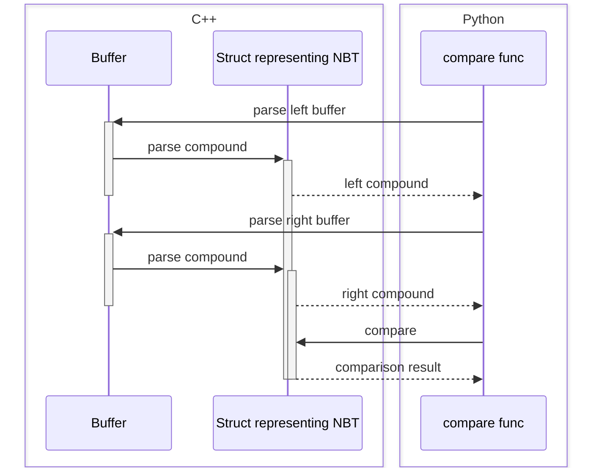
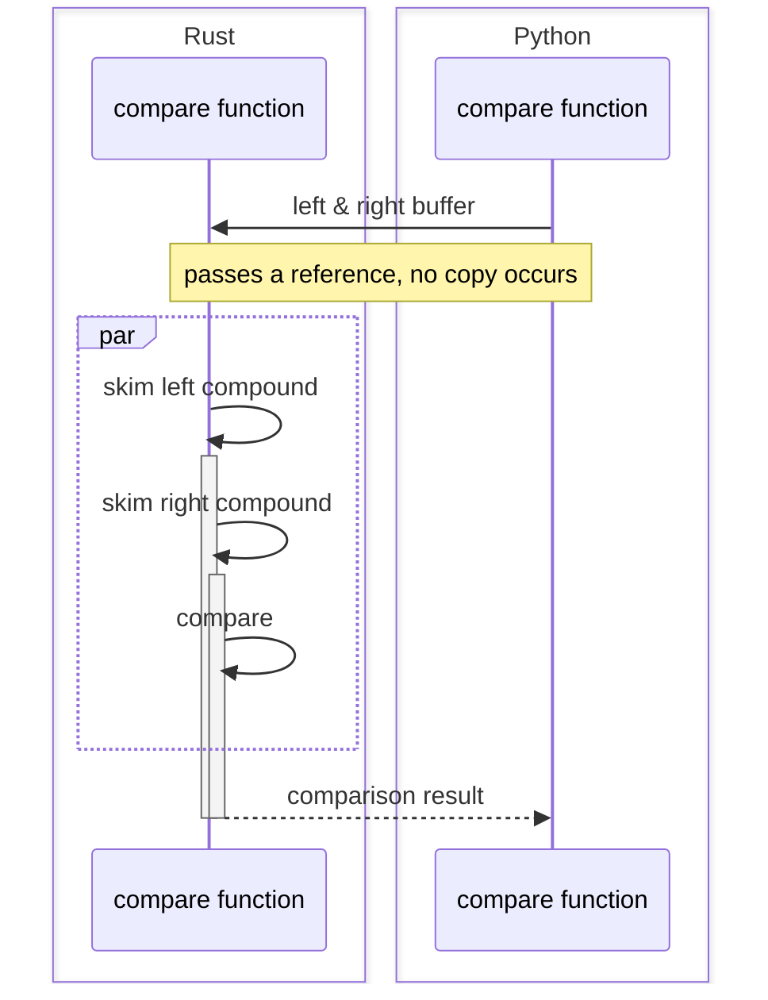
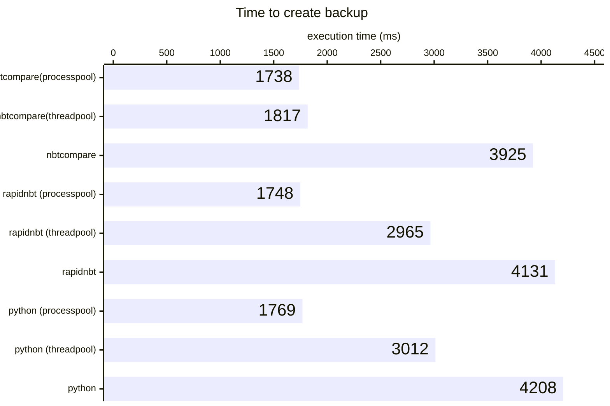

# NBTCompare

> [!IMPORTANT]
> This is a helper package for [MineDelta](https://github.com/Birnendampf/MineDelta)
> and is not meant to be used directly.

## Q&A

### Q: Why does this exist?

A: TL;DR: Because MineDelta needs to compare **a lot** of chunk data to determine which chunks changed.

Comparing NBT is harder than it seems: Compound tags are unordered so a pure binary comparison doesn't cut it.

This started out as a yet another NBT parser written in Python. It was way too slow.  
So I realized: you can "skip" a lot when parsing as long as you end up with a data structure resembling the compound.
<details>
<summary>Details</summary>

- Strings and numbers are kept as their binary representation
- Byte/int/long arrays are ordered → just represent them by their
  binary data
- Keep lists as binary if the tag ID of its contents is below 7: these are all fixed size tags, therefore the binary
  size of the list is known just based on the tag and size fields
- Represent compound tags as hash maps with binary keys and values consisting of a union of bytes, lists and hash maps.

```python
type RawCompound = bytes | dict[bytes, RawCompound] | list[RawCompound]
```

</details>

This resulted in roughly a 2x speedup, but it still wasn’t enough.  
Multithreading helped because decompression releases the GIL, yet parsing NBT was still the main bottleneck.  
[RapidNBT](https://pypi.org/project/rapidnbt/) seemed promising as it is written in C++. Unfortunately, it doesn't even
release the GIL when parsing, despite copying the buffer into C++ space. Furthermore, we were now back to full parsing
instead of "skimming over it" like described earlier.
Plus since all that mattered was comparison, the data flow looked like:



The python - c++ barrier is crossed 6 times! In the end this was just slightly faster than my Python implementation...  
Now here is the data flow with this extension module. Notice the "par" block symbolizing the fact that the GIL is
released, allowing multiple files to be processed in parallel:



Much neater :). On top of that, the rust "parser" (skimmer?) never actually copies from the passed in buffers (except
when parsing integers). It only uses slices referencing the buffer.

### Q: Can I use this for my own project?

A: Sure. But you are on your own, I do not have the time to support use cases I did not intend for sorry.

### Q: Why are there no tests?

A:  
  
(Working on it)

## Benchmark

Very irreproducible at the moment. will publish benchmarking code soon.
Tested on Ryzen 7 7800X3D, Linux Mint 22.3, Linux 6.8.0-100

